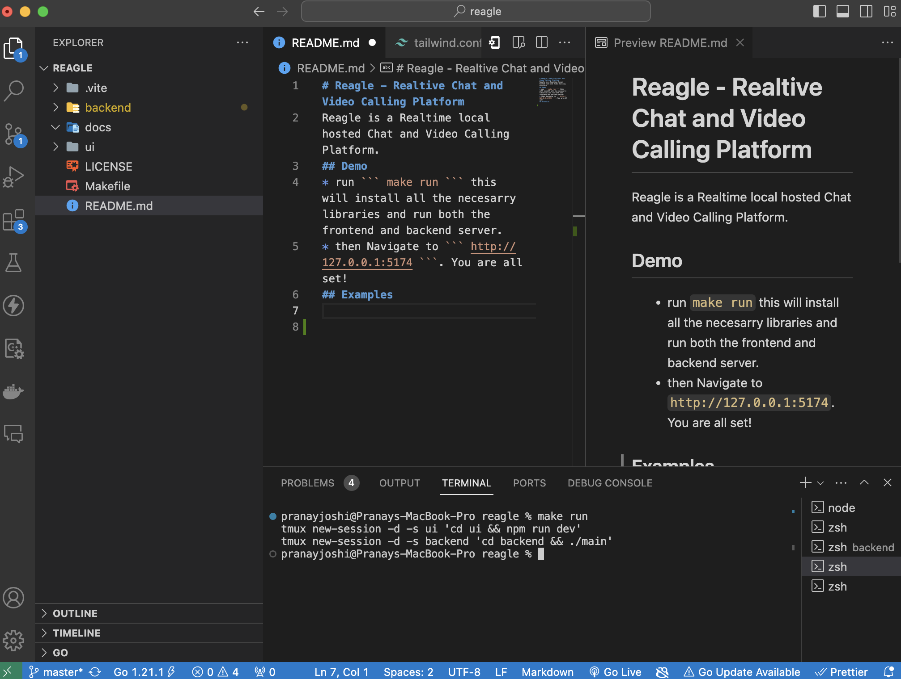
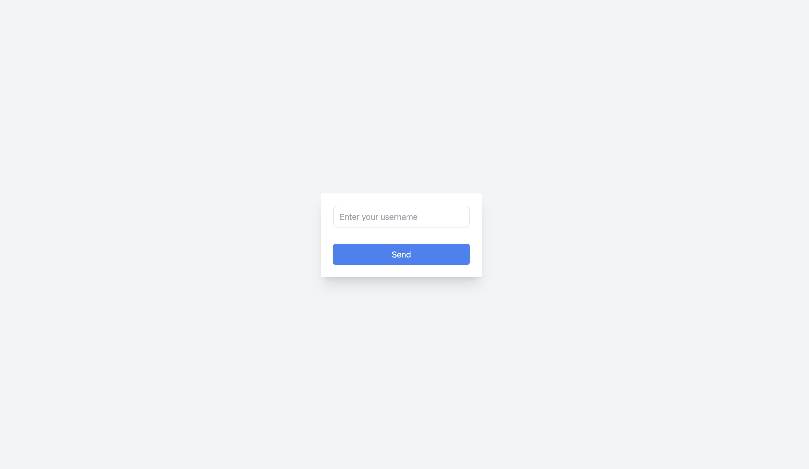
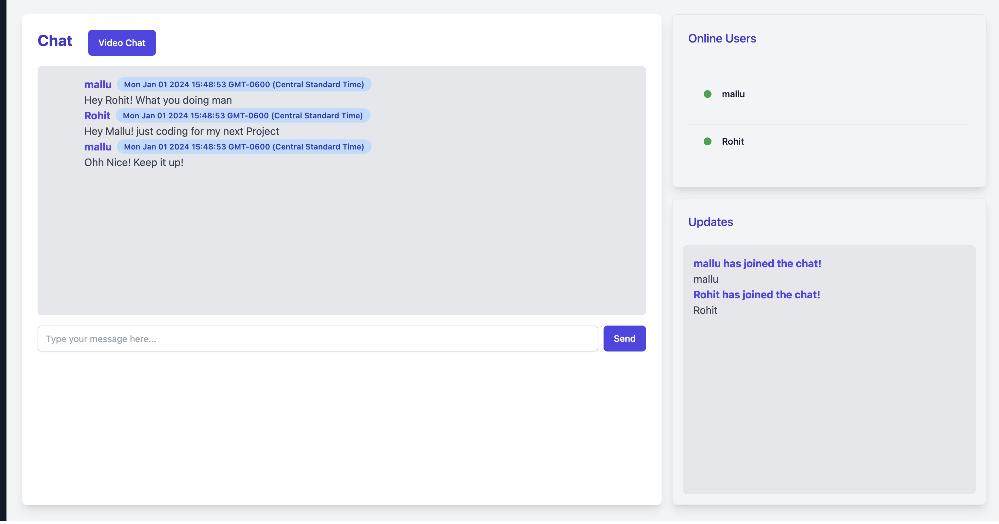
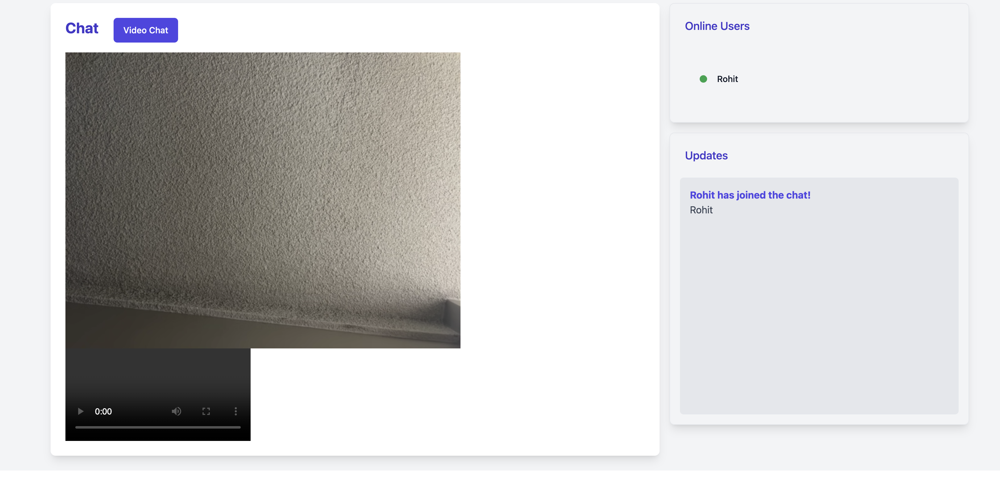

# Reagle - Realtime Chat and Video Calling Platform 

Reagle is a Realtime local hosted Chat and Video Calling Platform. It provides a seamless experience for communication through a user-friendly interface. 

## Features

| Feature | Description |
| --- | --- |
| Real-time chat | Send and receive messages in real-time. Messages are delivered instantly. |
| Video call | Start a video call with your friends or colleagues. |
| User-friendly interface | The interface is easy to use and intuitive. |

## Installation

To get started with Reagle, follow these steps:

1. Clone the repository: `git clone https://github.com/yourusername/reagle.git`
2. Navigate to the project directory: `cd reagle`
3. Run the application: `make run`

This will install all the necessary libraries and run both the frontend and backend server.

## Screenshots

Here are some screenshots of Reagle:

## Contributing

We welcome contributions from the community. If you'd like to contribute, please fork the repository, make your changes, and submit a pull request.

## License

This project is licensed under the terms of the MIT license.